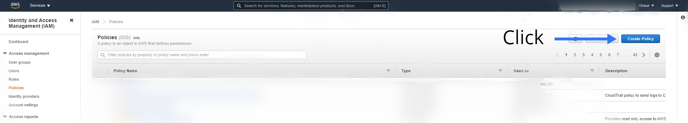
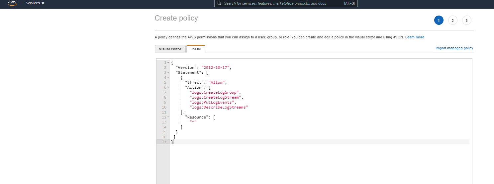
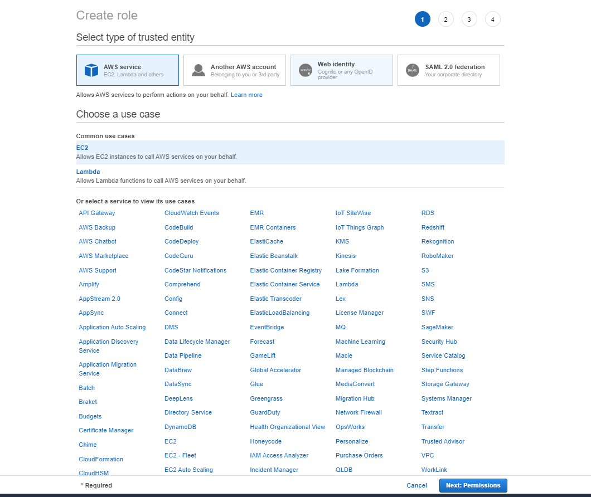
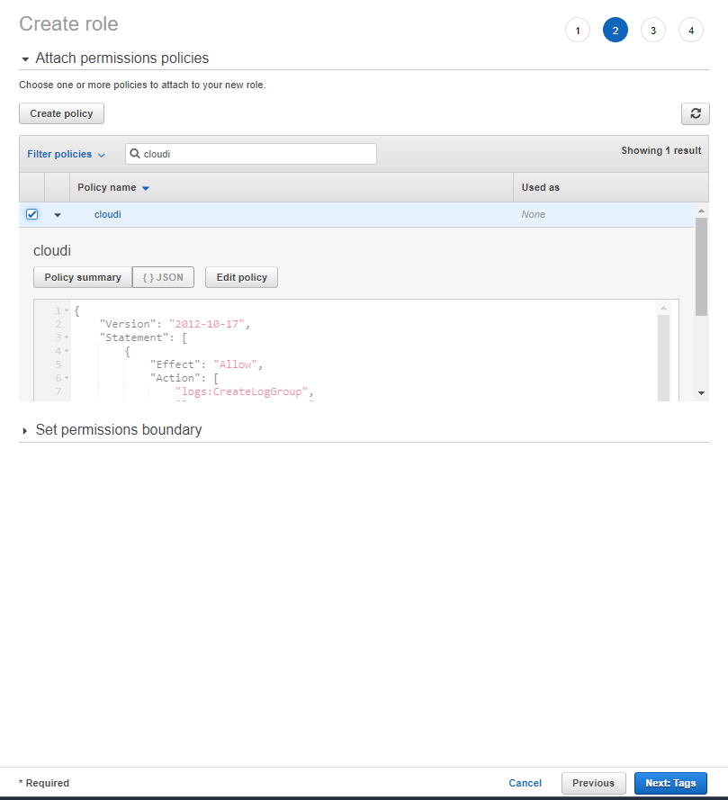
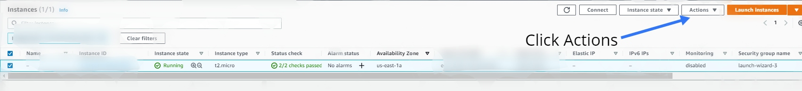
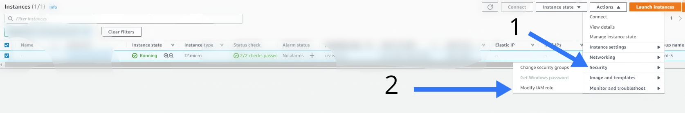
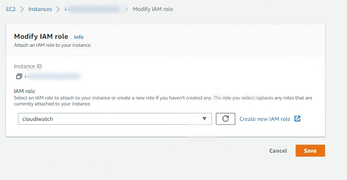

<br />
<p align="center"> 
    
  <h3 align="center">CloudWatch</h3>
  
  <p align="center">
    Fast way to authenticate EC2 instance
    <br /> 
    <a href="https://www.linkedin.com/in/ahmed-bejaoui-75b57318a"><strong>Linkedin</strong></a>
    <br />
    <br />
    <br />
    <br />
  </p>
</p>


 
<details open="open">
  <summary>Contents</summary>
  <ol> 
    <li><a href="#">Install CloudWatch Logs agent</a></li>
    <li><a href="#">Create IAM Policy</a></li>
    <li><a href="#">Create IAM Role And Attach Policy To It</a></li>
    <li><a href="#">Attach Role To EC2 Instance</a></li> 
  </ol>
</details>

<br />
<br />
<br />
 
## 1.Install CloudWatch Logs agent

1. SSH to the instance
   ```sh
   ssh ec2-user@IP -i key.pem
   ```
2. Update the instance
   ```sh
   sudo yum update -y
   ```
3. Install awslogs 
   ```sh
   sudo yum install awslogs -y 
   ```
<br />
<br />
<br />

## 2.Create IAM Policy

<br />
<br />
<h3 align="center">Go to IAM, then Policy and click create policy</h3>
<p align="center"> 
  
</p> 

<br />

<h3 align="center">In create policy click JSON and copy the policy below</h3>

```sh
{
  "Version": "2012-10-17",
  "Statement": [
    {
      "Effect": "Allow",
      "Action": [
        "logs:CreateLogGroup",
        "logs:CreateLogStream",
        "logs:PutLogEvents",
        "logs:DescribeLogStreams"
    ],
      "Resource": [
        "*"
    ]
  }
 ]
}
```
<p align="center"> 
  
</p> 

| Save the policy by name ( cloudi )


## 3.Create IAM Role And Attach Policy To It

<br />
<br />
<h3 align="center">Go to IAM, then Role and select AWS service then Choose EC2</h3>
<p align="center"> 
  
</p> 

| Then Next
<br />
 
<h3 align="center">In the search bar put the name of the policy we create (  cloudi ) and select it</h3>
<p align="center"> 
  
</p> 
| Save the Role by name ( cloudiwatch )
<br />

## 4.Attach Role To EC2 Instance

<br />
<br />
<h3 align="center">Open aws console and go to EC2 and select the instance</h3>
<p align="center"> 
  
</p> 

|  Next
<br />
 
<h3 align="center">Ater that Choose  Security => Modify IAM role</h3>
<p align="center"> 
  
</p> 
<br />

<br />
 
<h3 align="center">Select the role that we create and then save</h3>
<p align="center"> 
  
</p> 
<br />


```doc 
By that your EC2 instance will be authorized to push logs into CloudWatch,
Or you can create role with CloudWatchFullAccess permission and attach it to EC2, here you can use one of them
```

<br />


## Source
* [AWS Doc](https://docs.aws.amazon.com/AmazonCloudWatch/latest/logs/QuickStartEC2Instance.html) 
